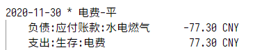

# hledger

## 安装
可参考 https://hledger.org/download.html, 另外 scoop 玩家也可以直接`scoop install hledger`.

随后在某个目录下创建一个账单文件, 如`account.journal`或者`2021.journal`.

增加一个环境变量`LEDGER_FILE`指向这个文件, 可以通过对所有`hledger`命令增加`-f`参数的方式避免添加环境变量.

## 准备

### 账户
因为hledger只定义了常见英文账户名, 我们需要定义中文基础账户类型如下:
```
account 资产              ; type:A
account 负债              ; type:L
account 所有者权益        ; type:E
account 收入              ; type:R
account 支出              ; type:X
```
从上到下分别指代 Assets, Liability, Equity, Reveue, eXpense

随后需要列出所有手头的账户并分类, 可以从几个开始并逐渐扩充, 如:
```
account 资产:流动资产:微信
account 资产:固定资产:公积金
account 资产:流动资产:招商银行
account 负债:信用卡:广发银行
```

### 货币类型
指定货币的分隔符, 精确度
```
commodity 1,000.00 CNY
```
当然你也可以增加其他的并指定汇率
```
commodity 1,000.00 USD

P 2021-06-15 USD 6.53 CNY
P 2021-07-15 USD 6.46 CNY
```

### 默认值
我们指定2021年和CNY作为默认年份和货币
```
Y2021
D 1,000.00 CNY
```

### 增加交易
hledger中的详细格式较为复杂, 一般常见的为:
```
2021-01-01 聚餐
    支出:饮食                         50.00 CNY
    资产:流动资产:支付宝              -50.00 CNY = 200.00 CNY
```
从左上到右下分别代表了日期, 交易描述, 账户1, 金额, 账户2, 金额, 最后的 200 为 assertion 代表交易后支付宝余额为200.

### 期初余额
一般在记账之初账户中都会有些余额, 可以通过期初余额调整
```
2021-03-01 期初
    资产:流动资产:微信       100.00 CNY
    所有者权益:期初余额     -100.00 CNY
```

## 常见命令
hledger本身的文档很长: https://hledger.org/1.22/hledger.html

但我常用的只有如下几个:
```
1. 检查账单是否有错误: hledger check -s
2. 导入账单：          hledger import <Path> --rules-file <Rule path>
3. 损益表:            hledger is
4. 资产负债表:         hledger bs
```

## 其他
因为中英文混杂的时候排版不齐对强迫症实在难受, 推荐2宽中文的[更纱黑体](https://github.com/be5invis/Sarasa-Gothic).

VSCode 配置:
```
{
    "editor.fontFamily": "'Sarasa Fixed SC', Consolas, 'Courier New', monospace"
}
```
效果如下

